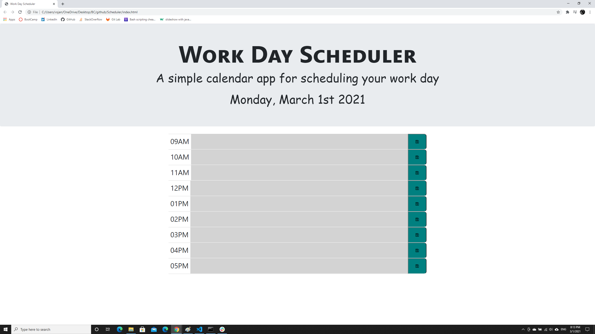
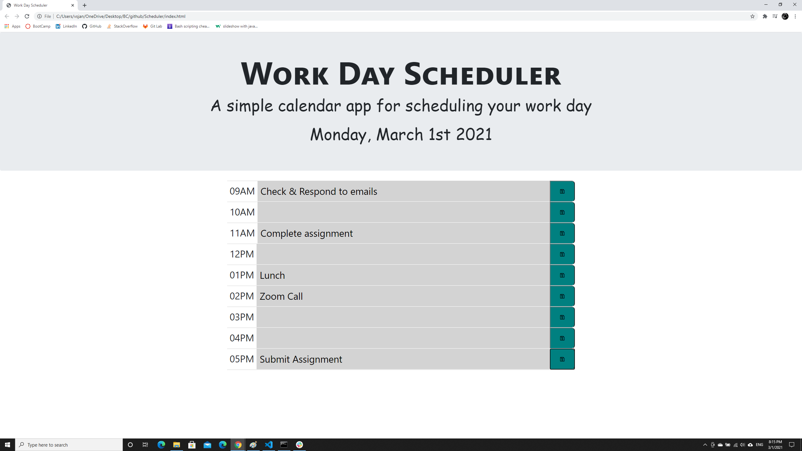

# Scheduler

## Description
This webpage displays a work day scheduler for Current/today's date. You can schedule events for each time blocks for the day and the time block starts from 9am and goes till 5pm.
The time blocks are color-coded to indicate whether they are in the past, present, or future. To enter or edit an event, click into a time block. To save the event click on the save button for that time block. The events are cleared from local storage the next day when you load the webpage.

## Live URL
Please find the website deployed here - [(https://vsjanarthani.github.io/scheduler/)]

## Built With
* HTML
* CSS
* JavaScript

## Screenshot of the Deployed Webpage

## Contribution
Made with :heart: by **Janarthani V Subramaniam**